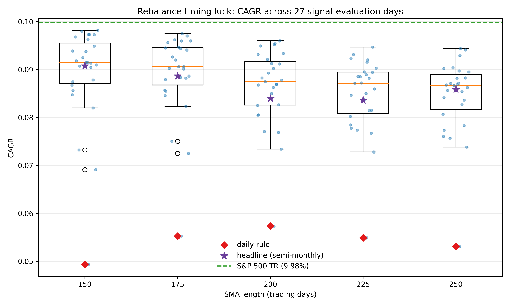

# VOO Constituent SMA Backtest

Institutional-style Python backtest for a constituent-level VOO trend-following strategy, built to research-grade data standards rather than around a strategy claim.

Repository: `https://github.com/Aroesler1/voo-constituent-sma-backtest`

## What it does

- **Point-in-time universe construction** from CRSP, with S&P membership history and delisting returns compounded into the final return of names that exit
- **Retail-implementable cost model**: EDGE effective spreads (Ardia, Guidotti & Kroencke, JFE 2024), opening-auction slippage, participation-based impact, and FINRA regulatory fees. Making costs the centrepiece rather than an afterthought is supported by ["Implementation Risk in Portfolio Backtesting"](https://arxiv.org/abs/2603.20319) (Yin, Miki, Lesnichenko & Gural, 2026), which ran 15 strategies across five open-source backtesting engines and found the engines agree exactly at zero cost ("isolating transaction-cost implementation as the sole source of disagreement") with divergence reaching 3.71% for high-turnover strategies, which at 4.5x annual turnover is the regime this strategy sits in
- **Multiple-testing-aware validation**: Deflated Sharpe Ratio over the SMA-length sweep, with the full configuration grid as the trial pool
- **A universe integrity audit** (`audit_universe.py`) that checks the CRSP ticker→PERMNO mapping is point-in-time correct, and a resolver (`permno_resolution.py`) that fixes it

That last item is what this repository is currently most useful for. The strategy is a 200-day SMA, deliberately simple. The infrastructure around it is the substance, and running the audit against it produced the finding below.

## Regenerated results (2026-09): the strategy loses to the index

Rerun after the data-integrity audit below, on 1,133 CRSP-resolved constituents, 7,300 trading days, 21,836 trades. Every table in this section is on the legacy `crsp.dsf` tape with `config.END_DATE` pinned to 2024-12-31.

| metric | Strategy | S&P 500 total return |
|---|---|---|
| CAGR | 8.40% | **9.98%** |
| Annualised volatility | 16.85% | 19.27% |
| Sharpe | 0.363 | **0.399** |
| Max drawdown | 54.4% | 55.2% |
| Annual turnover | 4.54 | 0.03 |
| Annualised cost | **68 bps** | 0 |

**The strategy underperforms simply holding the index, and does not reduce drawdown to compensate** (54.4% against 55.2%). Costs are about half the mechanism: 14.9 bps per trade at 4.5x annual turnover annualises to 68 bps, and rerunning the identical configuration with costs switched off recovers a 9.13% CAGR, so the measured drag is **74 bps against a 158 bp gap to the benchmark**. Costs explain 47% of the shortfall. The other half is the rule.

An earlier version of this table read 758 bps, and that figure was wrong. `metrics.py` averaged the cost rate over the days that traded and then annualised by 252, which prices a semi-monthly rebalance as if it rebalanced daily; this configuration trades on 9% of sessions, so the drag came out roughly eleven times too large. It is now annualised over every trading day and agrees with the costs-off rerun to within the compounding difference. `tests/test_quant_review.py` pins the behaviour. What the correction changes is the story, not the conclusion: the strategy still loses to the index, but it is no longer true that costs alone account for the loss.

### Family-wise error control across the sweep

The Deflated Sharpe asks whether the *selected* configuration beats the expected best of N noise strategies. Romano-Wolf stepwise testing asks a different question: across the whole sweep, which configurations beat the benchmark, holding the probability of **any** false rejection at 5%?

| null hypothesis | configurations significant |
|---|---|
| beats cash | **5 of 5** |
| beats the S&P 500 | **0 of 5** |

That contrast is the point. Tested against cash, every SMA length looks significant, but that says only that equities beat T-bills, which is a null no long-equity strategy can fail. Tested against actually holding the index, none of them clear the bar, and every configuration has a *negative* mean excess return (t between -0.88 and -1.35).

Choosing the weak null would have produced five significant results and a much better-looking repository. The benchmark-relative test is the one reported.

The Deflated Sharpe over the 9-configuration sweep is 0.985, meaning the *selected configuration* is unlikely to be the best of nine noise strategies. That is worth stating precisely: it says the configuration search did not manufacture the result. It does not say the result is good, and here it is not.

### Probability of Backtest Overfitting

The Deflated Sharpe asks whether the selected configuration's Sharpe survives the fact that several were tried. The **Probability of Backtest Overfitting** asks a sharper question about the selection procedure itself: pick the best configuration in sample, and how often does it land in the bottom half out of sample? Bailey, Borwein, López de Prado and Zhu, ["The Probability of Backtest Overfitting"](https://doi.org/10.2139/ssrn.2326253) (*Journal of Computational Finance* 20(4), 2017).

`statistics_mt.probability_of_backtest_overfitting` implements combinatorially symmetric cross-validation: the daily return panel is cut into 16 contiguous blocks, all C(16,8) = 12,870 ways of using half for training and the complement for testing are enumerated, and PBO is the share of those splits in which the in-sample winner ranked in the bottom half out of sample. CSCV is used rather than a single train/test cut because one cut point is arbitrary, and because the symmetric design means every block trains exactly as often as it tests.

It is computed over the **five SMA lengths that already exist** (150/175/200/225/250), on the 7,300-day panel from 1996-01-02 to 2024-12-31 (7,296 observations enter the statistic: the four trailing days that cannot fill a 16th equal block are dropped rather than folded into the last one, which would break the symmetry CSCV is named for). Widening the sweep would make PBO look more interesting without making it more informative.

| statistic | value |
|---|---|
| PBO | **0.613** |
| median out-of-sample rank of the in-sample winner | **3.0 of 5** |
| best in-sample configuration (full sample) | `sma_150` |
| symmetric splits enumerated | 12,870 |

**Read 0.613 against 0.60, not against 0.50.** With five configurations the out-of-sample rank takes five values, and "bottom half" means rank 3 or worse, so a ranking that carried *no* information at all would score 3/5 = 0.60. The observed 0.613 is that number. Picking the best SMA length in sample tells you nothing whatsoever about which length will do best out of sample, and the median out-of-sample rank of the in-sample winner is exactly the median rank.

That sits beside the Deflated Sharpe rather than contradicting it, because the two measure different things:

| | question | answer |
|---|---|---|
| Deflated Sharpe 0.985 | does the *selected* configuration's Sharpe survive the fact that nine were tried? | yes, the search did not manufacture it |
| PBO 0.613 | does the in-sample *ranking* predict the out-of-sample ranking? | no, it is indistinguishable from noise |

The configuration search did not invent the result, and the configuration choice is also worthless. Both are consistent with the headline: there is no edge here to select over. It is also why the 200-day being pre-specified matters more than its rank: at an annualised Sharpe of 0.5630 it places 4th of the 5 lengths (150: 0.5944, 175: 0.5854, 250: 0.5755, 200: 0.5630, 225: 0.5625), and PBO says that ordering would not repeat. Those sweep figures are a different Sharpe from the 0.363 in the results table above and are not comparable to it: the table reports `metrics.py`'s (CAGR minus cash rate) / annualised volatility, while the sweep ranks configurations on the per-period mean over standard deviation of `output/sma_sweep_returns.csv` annualised by root-252, an arithmetic mean with no cash rate subtracted, which is why it reads higher.

Reproduce. `main.py` writes the per-configuration daily returns as `output/sma_sweep_returns.csv` (the full pipeline takes about nine minutes and needs a WRDS entitlement); `run_pbo.py` then needs nothing else:

```bash
python main.py
```

```bash
python run_pbo.py
```

This is the expected outcome for a 200-day SMA on index constituents, and it is reported rather than buried. The contribution of this repository is the infrastructure and the audit, not the strategy.

### What the literature says

This result is not news, and presenting it as this repository's finding would overstate it. Zakamulin has made the same case twice on far longer samples: ["The Real-Life Performance of Market Timing with Moving Average and Time-Series Momentum Rules"](https://doi.org/10.2139/ssrn.2242795) (*Journal of Asset Management* 15, 2014) argues that the published performance of moving-average timing rules contains considerable data-mining bias and ignores market frictions, and that the advantage largely disappears in out-of-sample tests carrying realistic transaction costs; ["A Comprehensive Look at the Empirical Performance of Moving Average Trading Strategies"](https://doi.org/10.2139/ssrn.2677212) (2015) reaches the same conclusion over **155 years** of data, finding no single optimal lookback and no reliable out-of-sample edge. What is contributed here is not the conclusion but the audit trail behind it: a point-in-time CRSP universe with the ticker-to-PERMNO collisions actually resolved, a cost model built from a published spread estimator rather than a flat assumption, and the multiple-testing statistics reported below.

### Caveats on these numbers

- **The sample ends 2024-12-31 because that is where the end date is configured.** `config.END_DATE` is pinned to the last date the legacy CRSP tape carries; extending past it means moving to the CIZ tape (`crsp_v2.py`), not moving the string. Override it with `BACKTEST_END_DATE` if you have a reason to. It previously resolved to `"today"`, which produced two artefacts now gone: every current constituent was flagged as needing a "recent tail" this tape does not have, and the run was not reproducible, because the snapshot gate rejects any cached snapshot whose requested end predates the request, so the benchmarks refetched from WRDS at every date rollover. An earlier draft read the first artefact as a 32% coverage gap; it was not one. Under the pin the coverage report is clean, **1,133** tickers resolve and 1,064 actually trade, with trades running 1996-10-15 to 2024-12-16. **48** tickers never appear in CRSP's name history at all, mostly delisted shells (`AAMRQ`, `ABKFQ`) rather than live constituents.
- **EODHD was removed entirely (2026-09).** The loader previously fell back to a
  second vendor for tickers CRSP could not resolve, and spliced a vendor tail onto
  CRSP history for current constituents. Both are gone: unresolved tickers are now
  reported and excluded, so the universe is a single consistent PERMNO-keyed panel
  and the coverage gate sees the true shortfall rather than a patched-over one.
- **Dual-class tickers needed a fix.** Vendor and index files write `BRK-B`; CRSP writes `BRK` with the class in a separate `shrcls` field, so the hyphenated form matches nothing and every dual-class name was silently lost. `permno_resolution.split_share_class` now splits the suffix and matches on ticker plus share class: `BRK-B` resolves to permno 83443, `BF-B` to 29946.
- **The buy-and-hold column in the raw output is unreliable.** It reports a 2.86% CAGR, which is implausible for the period; the ETF benchmark has CRSP coverage only from late 2014 and the contaminated cache for it was quarantined. Compare against the S&P 500 total-return column instead.
- Pre-2019 constituent history remains proxy-based rather than a licensed point-in-time master.

## How much of a moving-average result is the calendar

Everything above reports one signal-evaluation schedule. Hoffstein, Sibears and Faber, ["Rebalance Timing Luck: The Difference between Hired and Fired"](https://doi.org/10.2139/ssrn.3319045) (*The Journal of Index Investing* 10(1), 2019, 27-36), give the reason to distrust that: two portfolios running an identical rule and differing only in which day inside the period they rebalance on are different portfolios, and the spread between them is *rebalance timing luck*. Their follow-up with Braun, ["Rebalance Timing Luck: The (Dumb) Luck of Smart Beta"](https://doi.org/10.2139/ssrn.3673910) (2020), measures it above 100 bps annualised for long-only factor indices, with one S&P index showing calendar-year return differences above 40% from the rebalance schedule alone.

`timing_luck.py` adds an evaluation-schedule option and runs all five SMA lengths against all 27 schedules: daily, five weekly anchors, and twenty-one monthly anchors. Anchors are trading-day ordinals rather than calendar weekdays, so every variant rebalances exactly once per period and the sweep varies *which* day without varying *how often*.

The headline schedule is carried alongside them as a 28th labelled row. It is not a 28th anchor: semi-monthly fires twice a month, so it is a frequency the anchor sweep does not contain. It is excluded from every dispersion statistic below and reported only to locate the headline inside the sweep.

| SMA | daily rule | **headline (semi-monthly)** | worst of 27 | best of 27 | CAGR range | CAGR s.d. | Sharpe range | gap, daily to index | range / daily gap | gap, headline to index | range / headline gap |
|---|---|---|---|---|---|---|---|---|---|---|---|
| 150 | 4.93% | 9.07% | 4.93% | 9.82% | **4.89 pp** | 1.06 pp | 0.278 | 5.04 pp | **0.97** | 0.90 pp | **5.41** |
| 175 | 5.53% | 8.86% | 5.53% | 9.75% | 4.22 pp | 0.91 pp | 0.241 | 4.45 pp | 0.95 | 1.11 pp | 3.79 |
| 200 | 5.73% | **8.40%** | 5.73% | 9.60% | 3.86 pp | 0.84 pp | 0.221 | 4.24 pp | 0.91 | **1.58 pp** | **2.44** |
| 225 | 5.49% | 8.36% | 5.49% | 9.47% | 3.98 pp | 0.82 pp | 0.228 | 4.49 pp | 0.89 | 1.62 pp | 2.46 |
| 250 | 5.31% | 8.58% | 5.31% | 9.44% | 4.13 pp | 0.83 pp | 0.240 | 4.67 pp | 0.88 | 1.39 pp | 2.97 |



**Where the headline sits.** The 8.40% this README leads with is the 200-day rule evaluated **semi-monthly**, which is `config.REBALANCE_DEFAULT` and is not one of the 27 anchors in the sweep. Placed among them it ranks **9th lowest of 27**: nineteen anchor schedules would have produced a higher CAGR for the same rule on the same data, and the best of them reaches 9.60% against the headline's 8.40%. It is not the unluckiest calendar available, which the daily rule is, but it sits in the bottom third of them.

That matters most for the error bar that actually applies to the headline. The gap from 8.40% to the index's 9.98% is **1.58 pp**, and the spread across evaluation days at 200 days is 3.86 pp: the calendar-choice dispersion is **2.44 times the shortfall the number is quoted to demonstrate**. Scaled against the daily rule the ratio is 0.91 and reads as "nearly all of it"; scaled against the headline it is greater than one at every length, from 2.44 at 200 days to 5.41 at 150. Either scaling says the same thing, and the second says it about the number on the first screen of this README.

Three things fall out of that table.

**The dispersion is nearly the whole result.** At every length the CAGR range across evaluation days is 88% to 97% of the entire gap between the daily rule and buy-and-hold. A reader handed the daily-evaluation number alone would be reading a quantity whose calendar-choice error bar is almost as wide as the effect being reported.

**Daily evaluation is the worst of the 27 at every single length.** Not near the bottom, the bottom: rank 1 of 27 for 150, 175, 200, 225 and 250 alike. The best variant is a monthly anchor in all five cases. That is not a coincidence of anchor choice, it is turnover. **At the 200-day length** the daily rule turns over 16.0 times a year against 3.1 for the monthly anchors, which at roughly 15 bps a trade is 240 bps of annual cost against 46 bps. That cost gap accounts for 42% to 50% of the spread at each length, so it is the largest single driver and not the whole of it; the rest is the rule acting on a different price.

**None of it rescues the strategy.** The luckiest calendar at the luckiest length reaches 9.82% against the index's 9.98%. The box does not straddle the benchmark line at any length. Timing luck is large enough to dominate the reported shortfall and not large enough to reverse the conclusion, which is the honest thing to say about it: the result is robust to the calendar in sign and worthless in magnitude.

Reproduce. This section and the two that follow share one panel load, which is why they share an entrypoint:

```bash
python run_timing_luck.py
```

## Index versus stock

Zakamulin's evidence against moving-average timing, cited above and reported on 155 years of data, is entirely *index-level*: both papers time a market index, not its constituents. This repository times the constituents. Those are different strategies, and no Zakamulin paper compares them directly, so the comparison below is this repository's rather than a replication: the same five rules applied to the S&P 500 total-return series, same cost model, same daily evaluation.

The single-instrument spread comes from the EDGE estimator run on the ETF's own OHLC. SPY is the instrument that tracks this series and CRSP covers it from 1993, so SPY's estimate is used throughout, averaging 21.2 bps. VOO is carried only as a cross-check: CRSP's first usable VOO estimate is 2011-03-09, and over the 3,477 overlapping days the two ETFs' EDGE spreads differ by 4.5 bps on average, with VOO the tighter at 18.4 bps. Using the more liquid instrument is the assumption that favours the index-level rule, which is the right direction for a test whose finding is that the index-level rule still loses.

| SMA | index CAGR | index Sharpe | index max DD | constituent CAGR | constituent Sharpe | constituent max DD |
|---|---|---|---|---|---|---|
| 150 | 5.69% | 0.282 | 36.3% | 4.93% | 0.162 | 68.0% |
| 175 | 6.76% | 0.367 | 29.4% | 5.53% | 0.199 | 66.6% |
| 200 | **7.43%** | **0.421** | 25.3% | 5.73% | 0.212 | 65.0% |
| 225 | 7.26% | 0.404 | 26.0% | 5.49% | 0.197 | 64.9% |
| 250 | 7.14% | 0.385 | 25.8% | 5.31% | 0.186 | 62.6% |
| *buy and hold* | *9.98%* | *0.399* | *55.2%* | | | |

The index-level rule beats the constituent-level rule at every length, and at the pre-specified 200 days it posts a **higher Sharpe than buy-and-hold** (0.421 against 0.399) on less than half the drawdown (25.3% against 55.2%), while still giving up 2.55 pp of CAGR. That is the classic shape of index-level trend following, and it does not survive at the stock level.

Where the constituent version loses, it loses on cost, not on signal. Rerunning both with costs switched off splits the shortfall exactly, since `shortfall = (index - constituent) with costs on` decomposes into `(index - constituent) with costs off` plus `(constituent cost drag - index cost drag)`:

| SMA | shortfall | whipsaw component | cost component |
|---|---|---|---|
| 150 | 0.76 pp | **-0.95 pp** | +1.71 pp |
| 175 | 1.24 pp | **-0.44 pp** | +1.67 pp |
| 200 | 1.70 pp | +0.06 pp | +1.63 pp |
| 225 | 1.77 pp | +0.33 pp | +1.44 pp |
| 250 | 1.83 pp | +0.31 pp | +1.52 pp |

The cost component is 1.4 to 1.7 pp at every length and swamps the other term. The whipsaw component is small, and at 150 and 175 days it is **negative**: gross of costs, running the rule name by name *beat* running it on the index. Applying a moving average to 500 stocks instead of to their index is not a worse signal here. It is a signal that costs two to three times as much to run: **at the 150-day length** the constituent version turns over 19.5 times a year against the index version's 9.5, and it wears per-name spreads instead of an ETF's.

## A timing rule that does work, as the control

A repository whose headline is that a timing rule fails needs to show that its pipeline can find a timing rule that works, or the headline says nothing about timing and only something about this code. The control is Moreira and Muir, ["Volatility-Managed Portfolios"](https://doi.org/10.1111/jofi.12513) (*The Journal of Finance* 72(4), 2017, 1611-1644): scale exposure by `c` over trailing realised variance, with `c` set so the average uncapped weight is one on the training half and exposure capped at 1.5.

Implementation detail that turned out to decide the answer: Moreira and Muir scale *monthly* returns, so the weight is set once a month and held. A literal reading of "trailing 21-day realised variance" retrades it daily. Both are reported, because the gap between them is the whole question of whether the effect survives costs. Costs are charged on the change in exposure at the same rates the engine charges elsewhere: 13.6 bps a side for the ETF, 14.9 bps for the constituent basket.

| leg | variant | CAGR | vol | Sharpe | Sharpe (arith.) | max DD | turnover |
|---|---|---|---|---|---|---|---|
| S&P 500 TR | buy and hold | 9.98% | 19.27% | 0.399 | 0.507 | 55.2% | 0.0 |
| S&P 500 TR | monthly, gross | 9.73% | 14.20% | 0.524 | 0.613 | 29.5% | 3.5 |
| S&P 500 TR | **monthly, net** | **9.21%** | **14.19%** | **0.488** | **0.579** | **30.1%** | 3.5 |
| S&P 500 TR | daily, net | 7.29% | 13.12% | 0.382 | 0.480 | 40.8% | 8.1 |
| equal-weight constituents | buy and hold | 12.14% | 20.13% | 0.489 | 0.592 | 56.7% | 0.0 |
| equal-weight constituents | monthly, net | 8.27% | 14.12% | 0.423 | 0.521 | 28.8% | 3.9 |
| equal-weight constituents | daily, net | 6.28% | 12.96% | 0.308 | 0.413 | 30.3% | 8.9 |

**The control works at the index level and only at the paper's rebalance frequency.** Net of costs the monthly overlay lifts the Sharpe from 0.399 to 0.488 and cuts the maximum drawdown from 55.2% to 30.1%, giving up 0.77 pp of CAGR. Retrading the same signal daily destroys the entire improvement, landing at 0.382, *below* buy-and-hold. It loses on both counts: 125 bps of CAGR before costs, because tracking a noisy variance estimate day by day is not the same as tracking volatility, plus 67 bps more in turnover. The pipeline can find the literature's effect, and the effect is smaller than the cost of implementing it carelessly.

It does not survive on the constituent portfolio. Equal-weight constituents lose 0.066 of Sharpe to the same overlay.

Given the same treatment as the SMA sweep, the control fails the same test, and for an instructive reason:

| null hypothesis | overlays significant |
|---|---|
| mean daily return beats own buy-and-hold, Romano-Wolf at 5% FWER over all six | **0 of 6** |

Every overlay has a negative mean excess return (t between -0.68 and -2.43). That is not a contradiction of the table above, it is the mean test seeing what it is built to see. Volatility management is not a return improvement and Moreira and Muir do not claim it is; it is a variance reduction that is larger than the return it costs. A mean-excess-return test cannot detect that, and the Deflated Sharpe computed on the same excess series is near zero for the same reason. The SMA rule delivers neither the return nor the ratio; the control delivers the ratio and not the return. Reporting only the Romano-Wolf line would have made the two look alike, and they are not.

There is a live dispute worth knowing about here. Cederburg, O'Doherty, Wang and Yan, ["On the performance of volatility-managed portfolios"](https://doi.org/10.1016/j.jfineco.2020.04.015) (*Journal of Financial Economics* 138(1), 2020, 95-117), find the strategy does not survive real-time implementation for most factors. The result above is consistent with a narrow version of that: it works on the market series, at the paper's frequency, and stops working as soon as either condition is relaxed.

A third leg was run and is reported in `output/vol_managed_control.csv` but is not in the table above, because it is degenerate rather than informative. Applying inverse-variance scaling to the constituent SMA-200 strategy collapses the average weight to 0.06: the strategy parks in cash for long stretches, realised variance there is near zero, `1/RV` explodes, and the mean of `1/RV` used to calibrate `c` is dominated by those stretches. Inverse-variance scaling is not defined in any useful way on a series that goes flat, which is a caveat on the method rather than a result about the strategy.

## Which CRSP tape

In January 2025 CRSP shipped the last release of Flat File Format 1.0 (SIZ) and now updates only Format 2.0 (CIZ). Schwarz, Walter and Weiss, ["Rewriting CRSP's History: Impact of Altered Monthly Returns on Asset Pricing"](https://doi.org/10.2139/ssrn.5074864) (*Journal of Financial and Quantitative Analysis*, 24 February 2026), measure the consequence: the transition "rewrites 9.62% of monthly returns by more than 1 basis point, primarily due to a change in the dividend reinvestment assumption", payouts reinvesting on the ex-date under CIZ against month-end under SIZ, with a 22 bp mean absolute difference among the altered returns and 11.43% of monthly long-short returns moving by more than 10 bps.

The same paper contains a prediction this repository is well placed to test. The reinvestment change is a *monthly* artefact, daily returns "did not change materially", and the authors rebuild CIZ monthly returns by compounding SIZ daily ones. A strategy evaluated on daily data should therefore be close to tape-invariant. `crsp_v2.py` re-pulls the whole constituent panel from `crsp.dsf_v2` and `run_tape_compare.py` reruns the headline configuration on both, holding the ticker-to-PERMNO resolution and the entire normalisation path fixed so that only CRSP's numbers change.

This table is the one place in the README still on the **pre-pin** configured end date of 2026-09-04, which is why it resolves 1,148 tickers where the headline resolves 1,133. The pin truncates the SEC holdings proxy at 2024-12-31 and drops 15 names that join the index after the sample ends and therefore never hold a position in it. Rerunning the comparison under the pin is pending a WRDS credential.

| | legacy `crsp.dsf` | CIZ `crsp.dsf_v2` |
|---|---|---|
| tickers resolved | 1,148 | 1,148 |
| trading days | 7,300 | 7,299 |
| sample | 1996-01-02 to 2024-12-31 | 1996-01-02 to 2024-12-31 |
| strategy CAGR | 8.396% | **8.362%** |
| strategy Sharpe | 0.3625 | **0.3606** |
| strategy max drawdown | 54.35% | 54.35% |
| annual turnover | 4.541 | 4.552 |
| trades | 21,836 | 21,906 |
| annualised cost | 67.9 bps | 68.1 bps |
| index CAGR | 9.977% | **10.039%** |
| index Sharpe | 0.3990 | **0.4023** |

| constituent-day returns | all days | excluding each security's final day |
|---|---|---|
| comparable ticker-days | 5,470,140 | 5,469,005 |
| **differ by more than 1 bp** | **671** (0.0123%) | **321** (0.0059%) |
| median absolute difference among those | 93.7 bps | 120.7 bps |
| mean absolute difference among those | 531 bps | 713 bps |
| covered by legacy only | 10,877 | 10,865 |
| covered by CIZ only | 0 | 0 |

The prediction holds. **671 of 5,470,140 constituent-days move by more than a basis point, 0.012%**, against the 9.62% the paper measures for monthly returns. The headline CAGR moves 3.4 bps, from 8.396% to 8.362%, and the Sharpe moves 0.0019. Of the 7,299 daily strategy returns, 784 differ at all above a basis point, with a mean absolute gap of 0.39 bps. A daily-frequency strategy really is close to tape-invariant, and the reason is exactly the one the paper gives: the reinvestment-timing change that rewrites monthly returns is invisible at daily frequency because daily returns already reinvest on the ex-date.

Two caveats on the 671, both of which cut the number rather than defend it.

**350 of them are a security's final day, and there they measure a gap in this loader rather than in CRSP.** The legacy path joins `crsp.dsedelist` and compounds `dlret` into a delisted name's last row; `crsp.dsf_v2.dlyret` does not carry it, and CIZ keeps delisting returns in a separate security-info history this loader does not yet read. Verified on Big Lots, 2024-09-06: both tapes report a price return of +9.11%, the legacy tape reports a total return of -76.28% after compounding the delisting return, and CIZ reports +9.11%. Excluding every security's final day leaves **321 genuinely altered ordinary days, 0.0059%**. Bridging the CIZ delisting source is the outstanding work on this comparison; it can only make the two tapes agree more closely, and the v2 column above is therefore a lower bound on agreement.

**The tapes' trading calendars differ by one day.** The legacy tape carries SPY on 1997-03-31 with zero volume and CIZ does not, which is the whole of the 7,300 against 7,299. Since SPY anchors the calendar, the v2 panel is one session shorter, and the small index CAGR difference (9.977% against 10.039%) is mostly that missing session rather than restated returns.

The largest single disagreement is not a delisting at all. On 1998-03-06 the legacy tape reports a **+220%** one-day return for `ETS` where CIZ reports +20%. That is the kind of thing the audit section below exists to find, and here the newer tape looks like the correct one.

**Which tape each table is on.** Every table in this README above this section is on the legacy `crsp.dsf` tape, including the headline results, the Romano-Wolf and PBO sections, the timing-luck sweep, the index-versus-stock decomposition and the volatility-managed control. The two-tape table in this section is the only one carrying `crsp.dsf_v2` numbers. Since the legacy tape stopped being updated in January 2025 and the sample ends 2024-12-31, that choice costs nothing in coverage; it will have to change for any extension past 2024.

```bash
python run_tape_compare.py
```

## The universe audit that prompted the rerun

An audit of the cached CRSP universe found that **437 of 1,153 tickers (38%) resolve to more than one PERMNO**. CRSP tickers are reused across companies and collide across share classes, and this loader resolved ticker to PERMNO without a point-in-time constraint, so a single "ticker" series could splice unrelated securities together.

Two distinct failure modes, both confirmed:

- **Sequential reuse: 327 tickers (28.4%) whose segments are separated by more than a year.** `SOLV` has a **26.7-year gap** between its two securities. The cached `VOO` series spliced **Vornado Operating Co** (permno 86379, common stock, 1998-2003) onto the **Vanguard S&P 500 ETF** (permno 12305, share code 73, 2014-2024). A 200-day SMA spanning such a boundary averages two different companies' prices, so the signal is corrupted, not merely one return.
- **Simultaneous share classes: 23 tickers with duplicate dates** (TAP, BIO, MKC, STZ, LEN, CBS, CNP). These raise inside `_extract_adjusted_series`; the exception is swallowed by a bare `except Exception` logged at DEBUG only, so the ticker is **silently dropped from the universe** - invisible selection bias.

Quantified with `quantify_contamination.py`: 288,281 of 6,198,577 rows (4.7%) fail point-in-time filtering, 27,474 returns are fabricated across splices, and 2,486 of those exceed 50% in a single day. The 200-day signal itself disagrees on only 0.01% of ticker-days, but returns above 200% still reach the P&L matrix.

Reproduce both:

```bash
python audit_universe.py --cache-dir data_cache
python quantify_contamination.py
```

The strategy evaluates the holdings underlying `VOO` on a point-in-time basis and holds only constituents trading above their `200-day SMA`, allocating capital equally across active names and routing the remainder to cash when breadth collapses.

## What This Project Does

- Builds a point-in-time constituent universe using:
  - SEC-based `VOO` holdings proxy post-2019
  - public S&P 500 membership history proxy pre-2019
- Fetches price history from `CRSP/WRDS`, the single price source
- Simulates daily, weekly, semi-monthly, and monthly rebalance schedules
- Applies realistic implementation assumptions:
  - next-session open execution
  - dynamic cash rates via FRED `DGS3MO`
  - spread, impact, slippage, and regulatory-fee modeling
  - frozen input snapshots and run manifests for reproducibility
- Produces a full research report:
  - equity curves
  - drawdowns
  - rolling Sharpe
  - active breadth
  - cost diagnostics
  - schedule comparison
  - SMA parameter sweep

## Repository Layout

```text
config.py            Runtime configuration and environment loading
data_loader.py       Vendor, snapshot, and cash-rate ingestion
preprocessing.py     Universe construction, resampling, liquidity features
panel.py             Point-in-time panel assembly, shared by every entrypoint
strategy.py          SMA and signal generation
backtest_engine.py   Constituent-level portfolio simulation
metrics.py           Performance and risk analytics
reporting.py         Tables, charts, and markdown report generation
main.py              End-to-end pipeline entrypoint
statistics_mt.py     Deflated Sharpe, Romano-Wolf stepdown, PBO via CSCV
timing_luck.py       Signal-evaluation schedules and the timing-luck sweep
vol_managed.py       Moreira-Muir volatility-managed overlay
crsp_v2.py           CRSP CIZ (dsf_v2) loader and tape comparison
run_pbo.py           Probability of Backtest Overfitting for the SMA sweep
run_timing_luck.py   Timing luck, index versus stock, volatility-managed control
run_tape_compare.py  Legacy CRSP tape against the post-2025 CIZ tape
data/universe/       Source universe proxy datasets
requirements.txt     Python dependencies
```

## Strategy Definition

For each eligible constituent:

1. Compute the `200-day SMA` on adjusted close.
2. Mark the name `active` when price is above its SMA.
3. On rebalance dates, allocate equally across active names.
4. If no names are active, stay in cash.
5. Execute at the next session open with modeled implementation costs.

Default reporting schedule is `semi_monthly`, with full comparisons against `daily`, `weekly`, and `monthly`.

## Realism Features

- Point-in-time constituent membership
- Snapshot-backed vendor inputs
- CRSP price sourcing, PERMNO-keyed and point-in-time
- Time-varying cash sleeve using `DGS3MO`
- Retail-implementable cost model:
  - opening-auction slippage
  - EDGE spread estimator (Ardia, Guidotti, Kroencke, JFE 2024) by default, Corwin-Schultz retained for comparison
  - participation-based impact
  - FINRA sell-side regulatory fee support
- Output manifests for deterministic reruns

## Statistical Honesty

- The SMA-length sweep and schedule comparison constitute a multiple-testing search, so the report includes the Deflated Sharpe Ratio (Bailey and Lopez de Prado 2014) for the selected configuration and for every sweep entry, with the full sweep treated as the trial pool. A high raw Sharpe with a low deflated Sharpe means the configuration choice is not statistically distinguishable from picking the best of several noise strategies.
- The Probability of Backtest Overfitting (CSCV; Bailey, Borwein, López de Prado & Zhu 2017) is reported alongside the Deflated Sharpe over the same five-length sweep. The two answer different questions: DSR asks whether the selected Sharpe survives the search, PBO asks whether the in-sample ranking predicts the out-of-sample ranking at all.
- Trade-level profit concentration (`profit_top5pct_share`, `profit_top10pct_share`) is reported because single-stock trend following concentrates most profit in a small tail of trades; averages alone hide this dependence.
- CRSP delisting returns (`dsedelist.dlret`) are compounded into the final return of names that exit, so departures do not silently leave at their last quoted price.

## Known Limits

- Pre-2019 constituent history is still proxy-based, not a licensed S&P point-in-time master.
- Adjusted-open execution on daily data is an approximation, even with QA repair.
- Corporate-event outliers in crisis periods can still exist in constituent data and should be reviewed before live deployment.
- **Any single evaluation schedule is close to uninformative on its own.** The spread across the 27 schedules is 88% to 97% of the gap between the daily rule and the index, so a number quoted for one calendar carries an error bar nearly as wide as the effect. Every result outside the timing-luck section is quoted on one schedule.
- **The pre-2010 index-level spread is SPY's, not the fund the strategy would have held.** CRSP's first usable VOO estimate is 2011; SPY's EDGE spread is used for the whole sample and averages 21.2 bps against VOO's 18.4 bps over the overlap.
- **CIZ delisting returns are not yet bridged.** `crsp.dsf_v2.dlyret` excludes the delisting return that the legacy path compounds in from `crsp.dsedelist`, so the v2 panel understates the loss on a delisted name's final day. This affects one row per delisted security, 350 of the 671 altered constituent-days, and makes the reported tape agreement a lower bound.
- **The volatility-managed control is only a control.** It is reported to show the pipeline can detect a timing effect the literature documents. It works on the index at monthly rebalancing and fails at daily rebalancing and on the constituent portfolio, and inverse-variance scaling is undefined in any useful sense on a long/flat series that parks in cash.
- The cash sleeve borrows at the three-month bill rate when the volatility overlay levers up to its 1.5 cap. A retail account pays more, so that leg is flattered.
- **A fully cached run still reaches for WRDS once.** The 48 tickers CRSP cannot resolve never acquire a snapshot, so the loader treats them as missing on every run, opens a connection for them and degrades to cache when it fails. Nothing else in the pipeline needs the network once the cache is warm. A negative cache for permanently unresolvable tickers would close this; it is not written yet.

## Setup

Create a local environment with `uv`:

```bash
uv venv .venv
source .venv/bin/activate
uv pip install -r requirements.txt
```

Create a `.env` file from `.env.example` and provide the credentials you have available:

```bash
cp .env.example .env
```

Supported credentials:

- `WRDS_USERNAME` / `WRDS_PASSWORD` for CRSP access
- `FRED_API_KEY` for cash-rate retrieval

## Running The Backtest

From the project root:

```bash
./.venv/bin/python main.py
```

Run the unit tests (no credentials required):

```bash
./.venv/bin/python -m pytest tests -q
```

## Generated Outputs

`output/` is gitignored and regenerating it needs a WRDS entitlement, so the small derived tables every number in this README is quoted from are committed to **`reports/`** as well. They are portfolio-level aggregates and difference counts only; no CRSP row and nothing under `data_cache/` is ever written there. `output/tape_largest_differences.csv` is the one table deliberately left out, because it carries raw CRSP returns per ticker-day.

```text
reports/
  timing_luck_variants.csv                  140 rows: 5 lengths x (27 anchors + the headline schedule)
  timing_luck_summary.csv                   dispersion per length, both range-over-gap scalings
  index_vs_stock.csv                        index and constituent rules, costs on and off
  index_vs_stock_decomposition.csv          shortfall split into cost and whipsaw
  vol_managed_control.csv                   the positive control, gross and net, both update frequencies
  vol_managed_romano_wolf.csv               family-wise test over the control legs
  tape_comparison.csv                       headline on both CRSP tapes
  tape_return_differences.csv               altered constituent-day counts
  tape_return_differences_ex_final_day.csv  the same, excluding each security's delisting row
```

Successful runs write artifacts to `output/`, including:

- `results_summary.csv`
- `detailed_report.md`
- `equity_curves.png`
- `drawdowns.png`
- `rolling_sharpe.png`
- `active_breadth.png`
- `cost_diagnostics.png`
- `schedule_comparison.png`
- `schedule_risk_return.png`
- `sma_sweep.png`
- `regime_comparison.png`
- `sma_sweep_returns.csv` (per-configuration daily returns; the input `run_pbo.py` needs)
- `pbo_sweep.csv`
- `run_manifest.json`

`run_timing_luck.py` adds:

- `timing_luck_variants.csv` (one row per SMA length and evaluation schedule)
- `timing_luck_summary.csv`
- `timing_luck_box.png`
- `index_vs_stock.csv`, `index_vs_stock_decomposition.csv`, `index_spread_notes.csv`
- `vol_managed_control.csv`, `vol_managed_romano_wolf.csv`

`run_tape_compare.py` adds:

- `tape_comparison.csv`
- `tape_return_differences.csv`, `tape_return_differences_ex_final_day.csv`
- `tape_largest_differences.csv`

## Intended Use

This codebase is designed for research-grade backtesting and strategy evaluation, not for direct live trading deployment without a licensed point-in-time constituent master and broker-specific transaction-cost calibration.
